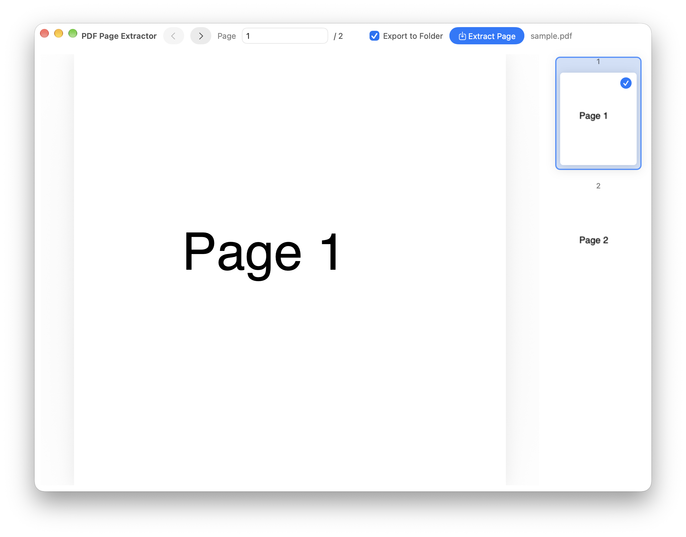

# PDF Page Extractor

[English](README.md)

在 Finder 中把需要的 PDF 页面保存为 PNG 图片。先预览文档，再选择一页或多页导出，方便放入笔记、演示文稿或分享给别人。也可以不打开预览窗口，一次导出 PDF 的全部页面。



## 能做什么

- **先看再导出**：左侧显示大幅页面预览，右侧显示页面缩略图。
- **只导出需要的页面**：点击缩略图选择，或输入 `1, 3-5, 9` 等页码范围。
- **处理多个 PDF**：在 Finder 中选中多个文件，在应用里切换要处理的 PDF。
- **整理输出图片**：保存到 PDF 旁的新文件夹，或直接保存到原文件所在目录。
- **一键导出全部页面**：通过配套的 **Extract PDF as Images** 快速操作，无需逐页选择。

图片为 **200 DPI、白色背景的 PNG**。遇到同名输出会自动添加编号，保留之前导出的文件。原 PDF 不会被修改，处理在本机完成。目前界面为英文。

## 安装

### 1. 下载应用与快速操作

打开[最新版本下载页面](https://github.com/Jingyuan-Zheng/PDF-Page-Extractor/releases/latest)，下载：

| 文件 | 用途 |
| --- | --- |
| `PDF-Page-Extractor-v1.0.0-arm64.zip` | 页面预览与选页导出的应用 |
| `PDF-Page-Extractor-Workflows.zip` | 两个 Finder 快速操作 |

应用下载包需要 **macOS 13 或更新版本，以及 Apple 芯片 Mac**（M1、M2、M3 等）。可在“苹果菜单 → 关于本机”查看芯片。Intel 用户可从源码自行构建，不提供 Intel 下载包。

### 2. 安装应用

1. 双击应用 ZIP 压缩包解压。
2. 将 **PDF Page Extractor.app** 拖入“应用程序”文件夹（`/Applications`）。快速操作也支持个人的 `~/Applications` 目录。

正常使用时，通过快速操作把选中的 PDF 传入应用。直接双击应用会显示“No PDF file was provided”，表示还没有提供 PDF 文件。

应用采用临时签名，未经 Apple 公证。首次通过快速操作启动时，若被 macOS 阻止，可到“**系统设置 → 隐私与安全性 → 仍要打开**”允许此应用，再确认系统提示。

### 3. 安装 Finder 快速操作

1. 解压 `PDF-Page-Extractor-Workflows.zip`，打开其中的 **Workflows** 文件夹。
2. 双击 **Extract Page to Image....workflow**，在提示中确认安装。
3. 如果需要一键导出全部页面，再双击 **Extract PDF as Images.workflow** 安装。
4. 在 Finder 中选中 PDF，右键查看“**快速操作**”或“**服务**”，找到相应操作。

如果没有显示，请在系统设置启用。较新的 macOS 可查看“**通用 → 登录项与扩展 → 扩展 → Finder**”，或“**键盘 → 键盘快捷键 → 服务 → 文件和文件夹**”；具体入口取决于系统版本，可参考 [Apple 扩展设置说明](https://support.apple.com/guide/mac-help/mtusr003/mac)。已有同名快速操作时，替换前请先备份。

**只有“导出全部页面”需要 Poppler。** 已安装 Homebrew 的用户，在终端运行：

```sh
brew install poppler
```

尚未安装 Homebrew，可先按 [brew.sh](https://brew.sh/) 的说明安装。页面预览应用及 **Extract Page to Image...** 不需要 Homebrew 或 Poppler。

## 使用

### 导出选定页面

1. 在 Finder 中选中一个或多个 PDF。
2. 右键 → **快速操作／服务 → Extract Page to Image...**。
3. 在预览窗口点击缩略图选择页面。按住 **Command** 选择多个不连续页面，按住 **Shift** 选择连续范围；也可在 **Page** 中输入 `1, 3-5, 9`，按回车确认。
4. 如果传入多个 PDF，通过文件下拉框切换当前要处理的文档。
5. 勾选 **Export to Folder**，会在 PDF 旁创建新文件夹；取消勾选，则直接保存到 PDF 所在目录。
6. 点击 **Extract Page／Extract N Pages**。导出完成后，Finder 会显示生成的图片。

左右箭头用于浏览预览页面；需要导出哪些页面，请通过缩略图或 **Page** 输入框选择。

### 导出全部页面

在 Finder 选中一个或多个 PDF，右键 → **快速操作／服务 → Extract PDF as Images**。每个 PDF 都会生成自己的新文件夹，每页对应一张 PNG。此操作不打开预览窗口，需要先安装 Poppler。

### 图片保存在哪里？

例如 `report.pdf`，勾选 **Export to Folder** 并导出第 1–3 页，会创建 `report_pages_1-3_images` 一类的文件夹，其中包含 `report_page_1.png`、`report_page_2.png`、`report_page_3.png`。

导出全部页面会创建 `report_images` 文件夹。再次运行时，会为同名文件夹或图片添加 `_2`、`_3` 等编号。需要有 PDF 所在目录的写入权限；无法保存时，可先把 PDF 复制到有写入权限的文件夹。

## 常见问题与限制

| 问题 | 处理方法 |
| --- | --- |
| 提示“No PDF file was provided” | 在 Finder 选中 PDF 后调用快速操作，不要直接双击应用。 |
| 快速操作找不到应用 | 将应用放入 `/Applications` 或 `~/Applications`，保持名称为 **PDF Page Extractor.app**。 |
| 提示“pdftoppm was not found” | 全部页面导出需要安装 Poppler。 |
| 无法保存图片 | 检查 PDF 所在目录的写入权限。 |
| 导出很多页面时窗口暂时无响应 | 页面为同步导出，大量页面可能需要等待。 |

输出格式与分辨率固定为 PNG／200 DPI。工具渲染整页，不提取 PDF 内嵌图片对象、不生成新的 PDF，也不执行 OCR。没有加密 PDF 的密码输入流程。

## 开发者说明

使用 Swift、AppKit 和 PDFKit。安装 Xcode Command Line Tools 与 Python 3 后运行：

```sh
python3 build_app.py
python3 Tests/smoke_test.py
python3 build_workflows.py
```

应用输出为 `dist/PDF Page Extractor.app`，默认构建当前芯片架构，最低部署系统为 macOS 13。Intel 可使用 `python3 build_app.py --arch x86_64`。构建应用无需第三方包。

`Workflows/` 包含可直接安装的文件；`build_workflows.py` 用于重新生成。全部页面导出的 workflow 内嵌 `scripts/pdf_extract_all_pages.sh`，无需另外安装脚本。

渲染验证会生成双页 PDF，调用应用实际渲染方法，检查 PNG 编码、200 DPI 尺寸与可见内容。macOS CI 会构建应用、验证签名、生成 workflows 并检查脚本语法。本机还验证了带空格的文件名和重复导出时不覆盖旧文件。

不使用快速操作时，也可以从终端启动：

```sh
open -n "/Applications/PDF Page Extractor.app" --args "/path/to/document.pdf"
```

诊断时可设置 `PDF_PAGE_EXTRACTOR_DEBUG=1` 运行可执行文件；日志可能包含文档路径，保存到 `/tmp/pdf-page-extractor.log`。

贡献方式见 [CONTRIBUTING.md](CONTRIBUTING.md)。作者：[Jingyuan Zheng](https://github.com/Jingyuan-Zheng)。采用 [MIT 许可证](LICENSE)。
